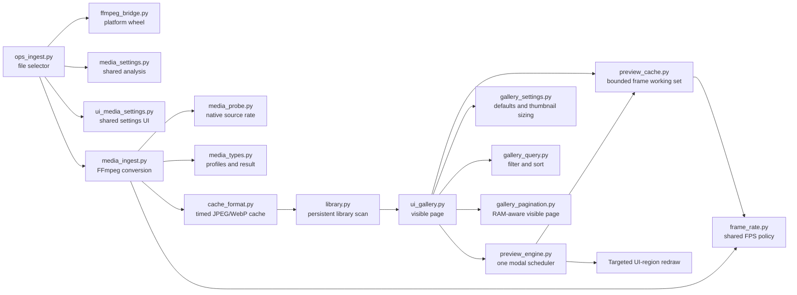

# Animated Thumbnail Preview Demo


A reusable example library for adding efficient animated preview thumbnails to
Blender extensions.

This repository turns GIFs, APNGs, videos, still images, and selected image
sequences into timed JPEG/WebP frame caches, then displays those frames inside
a normal Blender N-panel gallery through `bpy.utils.previews`.

The playback architecture provides:

- one guarded modal scheduler for every visible thumbnail;
- source-duration-aware frame boundaries;
- one shared Blender preview collection;
- bounded, incremental frame warming from the generated cache;
- a 32 MiB default preview-RAM target with an automatic protected working set;
- adaptive pagination sized from the RAM target and decoded-frame cost;
- only the visible gallery page advances;
- only the N-panel UI regions that drew the gallery are redrawn;
- a settings cog with thumbnail sizing, RAM control, an 8–60 FPS live ceiling,
  and opt-in optimized playback;
- viewport, timeline, and gallery-scroll pausing that matches the Beyond VRM
  behavior;
- missed mouse-release repair on Windows and macOS; and
- a low-frequency watchdog that replaces a timer only when its heartbeat is
  stale.

## Install and try the demo

1. Download `blender_animated_ui-<version>.zip` from the
   [GitHub Releases page](https://github.com/tdw46/blender-animated-ui/releases).
   Use the named extension asset, not GitHub's automatically generated
   **Source code** archive, because Blender expects the manifest at the ZIP root.
2. In Blender 4.2 or newer, open Preferences → Get Extensions, use the
   drop-down menu, and choose **Install from Disk**.
3. Open the 3D View sidebar and select the **Animated Previews** tab.
4. Click **Add Animated Media**.
5. Select one animated/image/video file, or multi-select an ordered image
   sequence.

The file browser analyzes the active media and shows its native FPS, full
duration, expected cache FPS, expected cache size, editable **Imported Name**,
and optional trim range.
New imports default to a 22 FPS ceiling. Media whose native rate is below 22 FPS
is sampled at that lower native rate instead of being upsampled. Use the arrow
beneath any card to rebuild it with new settings and an editable imported name,
rename it without rebuilding, open its cache directory, or delete it.


The gallery targets 32 MiB of decoded preview RAM by default. It automatically
paginates large libraries so each visible animated thumbnail can keep a useful
playback window warm. Use the numbered buttons at the bottom to change pages,
`<<` to return to the first page, and `>>` to jump to the last page. Every
control uses the same DPI-aware width and wraps into additional rows when the
N-panel cannot fit the complete sequence.

For planning an integration, allow at least five resident decoded frames per
visible animated item: the current frame, two frames of look-ahead, the
last-ready handoff, and one frame of headroom. The supplied paginator applies
that conservative rule after reserving one warm poster for every library item.
It is a safe sizing guideline rather than a timing guarantee; playback FPS,
storage speed, host load, and Blender's own preview overhead still matter.

Switching to another N-panel tab stops animation and redraw work but keeps the
last active page's resident frames warm for a quick return. Other gallery pages
retain one poster per item. Changing the page or filters replaces the warm page
set instead of refreshing unrelated media.

When an evicted frame needs to return, an existing thumbnail holds its
last-ready image while the frame settles. Newly imported media still uses
Blender's normal loading indicator until its first display frame is ready, so
the UI continues to distinguish a genuine first load from a background refill.

On the first ingest, the extension can install the platform-specific
`imageio-ffmpeg` 0.6.0 wheel into persistent extension-user storage. The wheel
contains its FFmpeg executable. Nothing is installed into Blender’s managed
extension source, the global Python environment, or a raw `.whl` path.

If Online Access is disabled, the extension asks the user to enable it before
running pip. An existing system FFmpeg executable is accepted as a fallback.

To build an installable ZIP from a source checkout, use the platform script and
then verify the result:

```bash
BLENDER_PATH="/absolute/path/to/blender" ./build.sh
python3 tools/verify_package.py blender_animated_ui-0.1.0.zip
```

On Windows, set `BLENDER_PATH` and run `build.bat`, then run the same verifier
with Blender's Python or another Python 3.11+ interpreter. The scripts validate
that `blender_manifest.toml` and legacy `bl_info` versions match before
packaging.

## Supported input

The practical format list is the set of image/video decoders supported by the
installed FFmpeg build. The file browser highlights common inputs:

- GIF, APNG, animated WebP;
- PNG, JPEG, WebP, BMP, TIFF, and other still images;
- MP4, MOV, M4V, AVI, MKV, WebM, MPEG, WMV, and FLV; and
- multiple selected image files treated as an ordered sequence.

Opaque inputs are converted to square JPEG frames with black letterboxing.
Sources with an alpha channel use square WebP frames with transparent
letterboxing. Both formats load through Blender preview collections in the
supported host versions while using substantially less cache space than a
full PNG cache in common cases.

Every import preserves the complete media range by default. Cache size never
causes an automatic FPS reduction, tail cut, or shorter preview window. Large
expected caches show a warning so the user can deliberately lower the import
FPS or enable **Trim Media**. Trim is disabled by default; its inclusive
**Begin Frame** and **End Frame** values initialize to the actual first and
last source frames after analysis.

Selected image sequences have no encoded native rate, so **Playback FPS**
defines their rate. Every selected image is retained unless Trim Media is
enabled. Sequence order can be alphanumeric ascending/descending, file date
oldest/newest, or Blender file-browser selection order.

## Module map

Each feature has a narrow boundary so projects can copy only what they need.

| Module | Responsibility | Blender dependency |
| --- | --- | --- |
| `frame_rate.py` | Shared FPS clamping, sampling, and playback-grid math | None |
| `media_probe.py` | Parse native FPS, dimensions, and duration from FFmpeg | None |
| `media_selection.py` | Default imported-name derivation and deterministic sequence ordering | None |
| `gallery_settings.py` | Shared cog defaults and thumbnail-scale calculation | None |
| `gallery_query.py` | Source-type classification, name filtering, and date/name sorting | None |
| `gallery_pagination.py` | RAM-aware page sizing, page bounds, and equal-width wrapped controls | None |
| `media_settings.py` | Typed import settings, probe analysis, and cache estimates | None |
| `media_types.py` | Typed cache-image profiles and ingest results | None |
| `cache_format.py` | Cache filenames, metadata schema, timing records | None |
| `media_ingest.py` | FFmpeg probing, trimming, and atomic cache generation | None when `cache_directory` is supplied |
| `ffmpeg_bridge.py` | Isolated wheel install and executable discovery | Blender path helpers and Python subprocesses |
| `paths.py` | Persistent extension-user cache/dependency paths | `bpy.utils` |
| `preferences.py` | Optional custom cache-root preference | Blender RNA |
| `preview_cache.py` | Warm, retain, and evict decoded frames; answer icon/timing queries | `bpy.utils.previews` |
| `preview_engine.py` | Visible-only modal scheduler, optimized mode, watchdog | Blender runtime |
| `properties.py` | Scene library items and WindowManager UI settings | Blender RNA |
| `library.py` | Scan persistent caches into Scene collections | Blender RNA |
| `ops_dependency.py` | FFmpeg install and readiness operator | Blender operators |
| `ops_ingest.py` | File selector, probe analysis, ingest, and item refresh | Blender operators |
| `ops_cache.py` | Library refresh, item menu, rename, cache folder, and deletion | Blender operators |
| `ops_gallery.py` | Gallery pagination and settings reset | Blender operators |
| `ui_media_settings.py` | Shared file-picker and refresh-dialog presentation | Blender `UILayout`/context, without a direct `bpy` import |
| `ui_gallery.py` | N-panel grid and settings-cog popover | Blender UI |
| `utils.py` | Small Blender-facing operator helpers | Blender runtime |
| `auto_load.py` | Discover and register extension-owned Blender classes | Blender registration |

The top-level `__init__.py` is intentionally limited to lifecycle wiring.

Recommended arrangement inside a destination extension:

```text
your_extension/
├── __init__.py                 # lifecycle calls only
├── auto_load.py                # class discovery/registration
├── constants.py
├── frame_rate.py               # pure shared FPS policy
├── media_probe.py              # pure FFmpeg probe parser
├── media_selection.py          # pure image-sequence ordering
├── gallery_settings.py         # pure gallery defaults and scale math
├── gallery_query.py            # pure gallery filtering and sorting
├── gallery_pagination.py       # pure RAM-aware pagination
├── media_settings.py           # pure import settings and estimates
├── media_types.py              # typed conversion profiles/results
├── paths.py
├── cache_format.py             # pure cache model
├── ffmpeg_bridge.py            # optional ingest dependency
├── media_ingest.py             # optional ingest pipeline
├── preview_cache.py            # preview icons and frame timing
├── preview_engine.py           # one persistent scheduler
├── properties.py               # RNA definitions
├── preferences.py              # custom cache location
├── library.py                  # cache-to-RNA synchronization
├── ops_dependency.py           # FFmpeg install
├── ops_ingest.py               # import and item refresh
├── ops_cache.py                # cache/library actions
├── ops_gallery.py              # pagination
├── ui_media_settings.py        # shared import/refresh settings UI
├── ui_gallery.py               # example presentation layer
├── utils.py                    # Blender-facing shared helpers
└── blender_manifest.toml
```

## Runtime call graph



## Integration profiles

Copy the smallest profile that matches the destination extension:

| Profile | Required modules | Use when |
| --- | --- | --- |
| Playback only | `constants.py`, `frame_rate.py`, `gallery_settings.py`, `gallery_query.py`, `gallery_pagination.py`, `cache_format.py`, `paths.py`, `library.py`, `preview_cache.py`, `preview_engine.py`, `properties.py` | Another system already creates compatible timed caches and owns its gallery panel |
| Ingest only | `constants.py`, `frame_rate.py`, `gallery_query.py`, `media_probe.py`, `media_selection.py`, `media_settings.py`, `media_types.py`, `cache_format.py`, `media_ingest.py` | A project needs conversion but owns its dependency and UI layers |
| Complete demo | All modules below | A project wants wheel installation, persistent library, N-panel gallery, preferences, and item actions |

`media_ingest.py` is importable without `bpy`. Pass an explicit
`cache_directory` to use it in a standalone Python process. When that argument
is omitted, it imports `paths.cache_root()` lazily and therefore expects to be
running inside Blender.

### Integrator quick start

1. Pick one integration profile above instead of copying unrelated layers.
2. Copy the listed modules with package-relative imports intact. If the
   destination already has an auto-loader, keep that loader and make it
   discover these classes; do not register the same classes through two
   auto-loaders.
3. Rename the operator/RNA namespace, set `ADDON_ID`, merge manifest permissions
   and compatibility ranges, and preserve `LICENSE` plus
   `THIRD_PARTY_NOTICES.md`.
4. Wire the registration hooks below in the documented order.
5. Decide whether the destination exposes the supplied FFmpeg install operator,
   uses a system executable, or supplies its own executable to
   `media_ingest.ingest_media()`.
6. Run pure tests, register in every declared Blender series, build the
   extension, verify the ZIP, and install that ZIP through **Install from Disk**.

The source directory is a development checkout, not the end-user install
artifact. Always test the built ZIP because extension namespace, manifest
permissions, excluded files, and persistent user paths differ from a direct
source import.

### Complete splice-in integration

For the complete reusable feature, copy these files into another extension:

```text
auto_load.py
cache_format.py
constants.py
ffmpeg_bridge.py
frame_rate.py
gallery_settings.py
gallery_query.py
gallery_pagination.py
media_probe.py
media_selection.py
media_settings.py
media_types.py
library.py
media_ingest.py
ops_cache.py
ops_dependency.py
ops_gallery.py
ops_ingest.py
paths.py
preferences.py
preview_cache.py
preview_engine.py
properties.py
ui_media_settings.py
ui_gallery.py
utils.py
LICENSE
THIRD_PARTY_NOTICES.md
```

Then make these project-specific edits:

1. Change `ADDON_ID` in `constants.py`.
2. Rename the `ANIMTHUMB_` class prefix and `animthumb.*` operator namespace if
   the destination project could collide with another installed copy.
3. Rename `animthumb_*` RNA properties if the destination extension already
   defines similarly named Scene or WindowManager properties.
4. Merge the `[permissions]` declarations from `blender_manifest.toml`.
5. Add or preserve the platform list required by the destination extension.
6. Keep the dependency and thumbnail cache directories in persistent
   extension-user storage.
7. Preserve `auto_load.py` exclusions for vendored or runtime-installed
   dependency trees.
8. Keep the GPL license and third-party notices with copied or distributed code.
9. Reload the extension after integration and test registration plus playback
   in every Blender series declared by the destination manifest.

### Registration hooks

After the auto-loader registers classes, call:

```python
from . import library, preview_cache, preview_engine, properties

properties.register_properties()
preview_cache.register_runtime()
preview_engine.register_runtime()
library.schedule_startup_refresh()
```

Unregister in reverse runtime order before asking the auto-loader to unregister
classes:

```python
library.cancel_startup_refresh()
preview_engine.unregister_runtime()
preview_cache.unregister_runtime()
properties.unregister_properties()
```

Do not access `bpy.data.scenes` while RNA classes are registering. The library
scan is intentionally deferred through `bpy.app.timers`.

## Public API

The following calls and data types are the intended splice-in surface. Names
beginning with `_` are implementation details and may move between modules.

| API | Purpose | Runtime requirement |
| --- | --- | --- |
| `media_ingest.probe_media(executable, source_path)` | Read native FPS, dimensions, duration, alpha, and frame count | FFmpeg executable; no Blender requirement |
| `media_ingest.ingest_media(executable, source_paths, **settings)` | Build or atomically replace one cache | FFmpeg; Blender only when `cache_directory` is omitted |
| `media_ingest.default_cache_image_profile(has_alpha)` | Return the demo JPEG/WebP conversion profile | None |
| `gallery_settings.DEFAULT_GALLERY_SETTINGS` | Shared search, filter, sort, size, FPS, RAM, and optimized-mode defaults | None |
| `gallery_settings.normalized_thumbnail_scale(value)` | Convert the Thumbnail Scale setting to the icon multiplier used by the gallery | None |
| `gallery_query.GalleryQuery` | Immutable search, media-type, and sort settings | None |
| `gallery_query.source_media_type(source_paths, is_sequence=False)` | Classify imported media from its source extension | None |
| `gallery_query.filter_and_sort_media(items, query)` | Compose name search, source-type filtering, and date/name sorting | None |
| `gallery_pagination.adaptive_page_size(...)` | Size a page from its RAM target, decoded-frame cost, and resident posters | None |
| `gallery_pagination.page_bounds(...)` | Resolve the stable slice for a zero-based gallery page | None |
| `gallery_pagination.pagination_layout_metrics(...)` | Calculate equal-width page-button columns from region width and UI scale | None |
| `gallery_pagination.pagination_buttons(...)` | Describe first, numbered, and last-page controls without Blender UI types | None |
| `gallery_pagination.pagination_button_rows(...)` | Wrap page controls into renderer-independent rows | None |
| `media_selection.default_media_name(source_paths)` | Derive the same default Imported Name used by UI and ingest | None |
| `media_settings.MediaImportSettings` | Immutable import, sequence-order, and trim settings | None |
| `media_settings.MediaAnalysis` | Immutable probe information shared by UIs | None |
| `media_settings.estimate_cache(analysis, settings)` | Estimate rate, duration, and output frame count | None |
| `media_types.CacheImageProfile` | Define a custom Blender-readable cache image profile | None |
| `media_types.IngestResult` | Typed immutable conversion result | None |
| `cache_format.read_metadata(cache_dir)` | Validate schema and timed frame files | None |
| `cache_format.update_metadata_name(cache_dir, name)` | Atomically rename a cache without rebuilding frames | None |
| `library.rename_item(item_id, name)` | Rename a discovered cache and refresh Scene libraries | Blender main thread |
| `preview_cache.load_item(item, force=False)` | Register one cache and warm its current poster | Blender main thread |
| `preview_cache.icon_id(item_id, now_ms, fps_limit=None)` | Resolve the current in-memory preview icon | Blender main thread |
| `preview_cache.next_interval_seconds(item_ids, now_ms, fps_limit=None)` | Find the earliest real boundary for visible items | Blender main thread |
| `preview_cache.pagination_memory_estimate()` | Report decoded-frame and resident-poster costs for page sizing | Blender main thread |
| `preview_engine.register_ui_region(context, item_ids)` | Declare exactly what a gallery region drew | Blender panel draw/main thread |
| `preview_engine.schedule_start()` | Ensure the shared scheduler is running | Blender main thread |
| `properties.reset_gallery_settings(context)` | Restore every settings-cog default and first page | Blender main thread |
| `paths.cache_root()` | Resolve and create the active persistent cache root | Blender runtime |

`IngestResult` supports both typed attribute access (`result.frame_count`) and
mapping access (`result["frame_count"]` and `result.get(...)`). Typed attributes
are recommended. Use `result.as_dict()` when a detached dictionary is required
for JSON.

Blender RNA and preview APIs are not thread-safe. Operators, Scene collection
updates, preview collection loads/removals, scheduler registration, and UI
redraw requests must run on Blender's main thread. FFmpeg itself runs in a
subprocess, but the supplied operators currently wait for that subprocess from
the main thread so they can report a deterministic finished/failed result.

## Using only the playback library

Projects that already generate compatible timed image caches can skip `ffmpeg_bridge.py`,
`media_ingest.py`, `media_settings.py`, `media_types.py`, `ops_dependency.py`,
`ops_ingest.py`, and `ui_media_settings.py`.

Create a cache directory containing `metadata.json` and timed images:

```text
thumbnail_cache/
└── walk_cycle_a1b2c3d4/
    ├── metadata.json
    ├── frame_000__00000000_00000100.jpg
    ├── frame_001__00000100_00000200.jpg
    └── frame_002__00000200_00000300.jpg
```

Load a Scene item once:

```python
from . import preview_cache

preview_cache.load_item(item)
```

During panel draw, get the current icon entirely from memory:

```python
from . import preview_engine, preview_cache
from .constants import GALLERY_ICON_SCALE
from .gallery_settings import normalized_thumbnail_scale

now_ms = preview_engine.current_preview_ms()
icon_id = preview_cache.icon_id(
    item.item_id,
    now_ms,
    fps_limit=preview_engine.preview_frame_rate(),
)
icon_scale = GALLERY_ICON_SCALE * normalized_thumbnail_scale(
    context.window_manager.animthumb_thumbnail_scale
)
layout.template_icon(icon_value=icon_id, scale=icon_scale)
```

Tell the scheduler which items this UI region actually drew:

```python
visible_ids = tuple(item.item_id for item in visible_page)
preview_engine.register_ui_region(context, visible_ids)
preview_engine.schedule_start()
```

That visibility registration is essential. It prevents off-screen pages,
closed panels, unrelated windows, and stale regions from advancing frames or
generating redraw traffic. Their poster frames remain warm for immediate
display when the page or N-panel tab returns.

## Using only the ingest library

The conversion layer is callable without the demo panel:

```python
from .ffmpeg_bridge import status
from .media_ingest import ingest_media

ffmpeg = status()["executable"]
result = ingest_media(
    ffmpeg,
    ["/path/to/animation.gif"],
    display_name="My Animation",
    target_fps=22,
    trim_media=False,
)
print(result.cache_dir)
```

The complete Blender UI calls `ops_dependency.prepare_ffmpeg()` before ingest.
That route honors Blender's Online Access setting, prefers an already installed
wheel or system FFmpeg, and exposes an explicit install operator when neither is
ready. A custom Blender UI should follow the same pattern; it should not perform
network installation from panel draw code.

Outside Blender, provide the destination explicitly so the module never imports
`bpy` through the extension path helper:

```python
result = ingest_media(
    "/absolute/path/to/ffmpeg",
    ["/path/to/animation.gif"],
    cache_directory="/path/to/generated_thumbnail_caches",
)
```

Standalone callers should supply their own FFmpeg executable and
`cache_directory`; `ffmpeg_bridge.py` intentionally uses Blender's persistent
extension-user paths and is not part of the Blender-free ingest profile.

For image sequences, pass every file in display order:

```python
result = ingest_media(
    ffmpeg,
    [
        "/path/to/frame_0001.png",
        "/path/to/frame_0002.png",
        "/path/to/frame_0003.png",
    ],
    target_fps=22,
    sequence_order="ALPHANUMERIC_ASC",
)
```

`ingest_media()` stages the conversion, writes metadata atomically, swaps a
previous cache only after success, and restores the prior cache if the final
swap fails. It returns an immutable `IngestResult`. Existing dictionary-style
callers remain compatible, but attribute access is the preferred API.

`target_fps` is optional and defaults to 22. It is clamped to the supported
8–60 FPS range by `frame_rate.clamp_preview_fps()`. For encoded animated media,
`media_probe.parse_ffmpeg_probe()` detects the source rate. The import rate is:

```text
sample_fps = min(target_fps, source_fps)  # when native FPS is known
```

An unknown source rate leaves the requested ceiling unchanged rather than being
guessed.
Consequently, the default request for a 12 FPS GIF/video produces an
approximately 12 FPS cache instead of duplicated cache frames. A 15-second,
24 FPS video produces an approximately 330-frame, 15-second cache at the
default 22 FPS ceiling, or the full 360 source frames if its ceiling is raised
to 24. If `source_fps` itself is below 8 FPS, that genuine native rate is kept;
the 8 FPS minimum applies to user-selectable ceilings, not to retiming slow
source media.

Trimming is always opt-in:

```python
result = ingest_media(
    ffmpeg,
    ["/path/to/animation.mp4"],
    target_fps=30,
    trim_media=True,
    trim_start_frame=121,
    trim_end_frame=240,
)
```

Frame bounds are 1-based and inclusive. With `trim_media=False`, the begin/end
values are ignored and the complete source is cached. `trim_end_frame=0` means
the real media end when a caller cannot pre-probe it.

### Cache image profiles

The default profile resolver uses JPEG quality level 3 for opaque sources and
WebP quality 82/compression level 4 for sources with alpha. JPEG receives black
letterboxing; WebP receives transparent letterboxing. Transparent VP8/VP9 WebM
files are recognized from their WebM alpha metadata and decoded through libvpx
so their separate alpha stream reaches the cached WebP frames.

An integration can replace those settings without forking the pipeline:

```python
from .media_ingest import ingest_media
from .media_types import CacheImageProfile


def my_cache_profile(has_alpha: bool) -> CacheImageProfile:
    if has_alpha:
        return CacheImageProfile(
            extension="webp",
            metadata_format="WEBP",
            pad_color="color=0x00000000",
            ffmpeg_args=("-c:v", "libwebp", "-quality", "90"),
        )
    return CacheImageProfile(
        extension="jpg",
        metadata_format="JPEG",
        pad_color="color=0x000000",
        ffmpeg_args=("-q:v", "2"),
    )


result = ingest_media(
    ffmpeg,
    sources,
    image_profile_resolver=my_cache_profile,
)
```

Supported cache extensions are PNG, JPEG, and WebP. A custom FFmpeg profile is
still responsible for producing files Blender can load through
`bpy.utils.previews` on every host version in the extension's declared support
range. Test opaque and alpha outputs in those actual Blender runtimes; a
successful standalone FFmpeg conversion is not sufficient compatibility proof.

### Frame-rate integration contract

The demo exposes two independent frame-rate settings:

- each import/refresh operator owns a per-item `target_fps` ceiling, default 22;
- `WindowManager.animthumb_preview_fps` is the current 8–60 FPS live gallery
  ceiling, default 10.

The live value must be connected to both frame lookup and scheduling:

```python
# Live playback: affects loaded caches immediately.
icon_id = preview_cache.icon_id(item_id, now_ms, fps_limit=preview_fps)
interval = preview_cache.next_interval_seconds(
    visible_ids,
    now_ms,
    fps_limit=preview_fps,
)
```

The `fps_limit` keyword is optional. Omitting it preserves uncapped,
source-boundary playback for projects that provide their own scheduler. The
demo’s `preview_engine.preview_frame_rate()` reads and clamps the registered
WindowManager value for both scheduler and panel-draw calls.
`preview_cache.py` also applies a cache’s stored `source_fps` independently, so
a high global ceiling cannot make a slower encoded source advance faster.
`preview_cache.display_frame_rate()` exposes that same resolved per-item rate
for UI labels:

```python
visible_fps = preview_cache.display_frame_rate(
    item_id,
    fps_limit=preview_fps,
)
```

The demo uses this result beneath each thumbnail, so moving the settings slider
immediately updates both live playback and the displayed FPS number. The number
is the active display rate—`min(global ceiling, cache rate, native source
rate)`—rather than immutable ingest metadata.

Changing the live ceiling does not rebuild caches. Use a card's arrow menu and
**Refresh with New FPS Settings** to change that item's import sampling,
sequence order, or trim range while preserving its cache identity.

`ANIMTHUMB_OT_IngestMedia` and `ANIMTHUMB_OT_RefreshItem` intentionally declare
their Blender RNA properties separately. Their calculations and presentation
are shared through `media_settings.py` and `ui_media_settings.py`, but the
property declarations are kept on each registered operator. This avoids
registration-sensitive property mixins and makes both operator schemas
discoverable through Blender's RNA API.

### Mixed playback frame rates

Each cache retains its own cumulative frame boundaries and effective rate.
`preview_cache.next_interval_seconds()` calculates each visible item’s next
boundary independently and returns only the earliest one to the shared timer.
At that event:

- a 12 FPS thumbnail advances only on its own roughly 83 ms boundaries;
- a 24 FPS thumbnail advances on its own roughly 42 ms boundaries;
- a 60 FPS thumbnail can advance on roughly 17 ms boundaries; and
- static thumbnails never create animation ticks.

The engine compares signatures per item and redraws only registered UI regions
containing an item that changed. When several rates share one N-panel region,
the scheduler wakes for the earliest real boundary among them—the same policy
as the Beyond VRM implementation. The region's redraw cadence can therefore
approach the union of distinct boundaries: a 30 FPS and 12 FPS pair can cost up
to roughly 42 redraw opportunities per second when their boundaries do not
coincide. It is still capped by the live ceiling and the 60 FPS scheduler
minimum interval. Unchanged thumbnails retain their frame; they are never
advanced, decoded, or regenerated at a neighbor's rate.

### Cache location and item actions

By default, caches live in Blender's persistent extension-user storage, not in
the installed extension source. The extension Preferences panel exposes an
optional **Thumbnail Cache Location** directory. `paths.cache_root()` is the
single integration point, so changing the preference affects ingest, discovery,
refresh, and deletion consistently.

Changing the setting never moves or deletes an existing cache. The gallery
rescans the newly selected root; switching back restores discovery of caches in
the previous root. Integrations that want migration should implement it as a
separate, explicit operation.

The per-card arrow menu contains:

- **Refresh with New FPS Settings**, which atomically rebuilds the same cache
  identity and exposes the current **Imported Name**;
- **Rename Thumbnail**, which atomically changes only the name in cache metadata
  without moving the cache directory or rebuilding frames;
- **Open Thumbnail Cache Directory**, which uses Blender's path-open operator
  with a capability-gated OS fallback; and
- **Delete Thumbnail**, which removes only that generated item directory.

## Cache schema

`metadata.json` is the disk/runtime boundary:

```json
{
  "schema_version": 1,
  "item_id": "e0c65c...",
  "name": "Walk",
  "source_paths": ["/absolute/path/walk.gif"],
  "width": 512,
  "height": 512,
  "media_kind": "MEDIA",
  "source_type": "GIF",
  "date_added_utc": "2026-07-28T12:00:00.000000Z",
  "cache_image_format": "WEBP",
  "trim_media": false,
  "trim_start_frame": 1,
  "trim_end_frame": 72,
  "duration_ms": 6000,
  "preview_duration_ms": 6000,
  "source_duration_ms": 6000,
  "target_fps": 60.0,
  "source_fps": 12.0,
  "sample_fps": 12.0,
  "effective_fps": 11.666667,
  "frames": [
    {
      "index": 0,
      "start_ms": 0,
      "end_ms": 100,
      "file": "frame_000__00000000_00000100.webp"
    }
  ]
}
```

Timing is stored cumulatively. The engine selects the frame whose
`start_ms <= loop_time < end_ms`, then reschedules itself for the next real
boundary on the configured playback sampling grid instead of assuming every
timer tick means a new frame. `target_fps` is the user ceiling, `source_fps` is
the detected encoded-media rate, `sample_fps` is the FFmpeg extraction rate,
and `effective_fps` records the rate the completed cache actually represents.
`duration_ms`/`preview_duration_ms` describe the cached playback loop, while
`source_duration_ms` preserves the full probed input duration. They match within
frame-rounding tolerance unless the user explicitly enabled Trim Media.

FPS, source/preview duration, source type, date added, media kind, cache format,
sequence order, and trim fields are additive in schema version 1. Older
schema-v1 PNG caches without them continue to load.

`source_type` is the uppercase source extension captured at import
(`MP4`, `GIF`, `APNG`, and so on), or `SEQUENCE` for a selected image sequence.
`date_added_utc` records the original import time and is preserved by per-item
refreshes. Older caches derive their type from `source_paths` and use the
metadata file modification time as their added-date fallback.

### Schema migration policy

Keep additive, optional metadata changes within schema version 1 and provide
safe defaults in `cache_format.read_metadata()`. Increment
`CACHE_SCHEMA_VERSION` only when an existing field changes meaning or the frame
record layout becomes incompatible.

When a future schema is necessary:

1. teach the reader to recognize both the previous and new schema;
2. migrate into a staging directory rather than rewriting the working cache;
3. validate every referenced frame before the atomic directory swap;
4. retain the previous directory until the replacement is published;
5. invalidate the corresponding in-memory preview entry; and
6. offer an explicit rebuild from `source_paths` when lossless migration is not
   possible.

Do not silently delete an unsupported cache during discovery. Skip it, preserve
it on disk, and expose enough status for the user or integrating extension to
rebuild it deliberately.

## Playback performance contract

Panel draw remains a memory lookup after the scheduler has warmed the current
window. The modal scheduler may incrementally load bounded frame batches from
an already generated cache to maintain that window. Neither path performs
directory scans, metadata reads, cache generation, or full-area/full-viewport
redraws.

Ingest, refresh, deletion, and load-post rebuild own structural disk work.
Incremental preview loads are scheduled and RAM-bounded; they are not triggered
by unrelated media cards during panel draw.

The settings-cog popover exposes:

- **Search**, a case-insensitive title filter;
- **Media Type**, using the source type stored during import;
- **Sort**, with newest/oldest date-added and A–Z/Z–A name ordering;
- **Thumbnail Scale**, which drives both the visual icon scale and DPI-aware
  column wrapping. It defaults to 1.0 and supports values from 0.5 through 4.0;
- **Live Playback FPS Ceiling**, which immediately caps live thumbnail sampling
  and updates each card’s active FPS label from 8 through 60 FPS;
- **Preview RAM Budget**, a 16–2,048 MiB target that defaults to 32 MiB. The
  gallery reduces its adaptive page size when the target cannot hold five
  decoded frames per visible item after resident posters are reserved. The
  settings popover reports the currently loaded MiB and decoded-frame count;
- **Optimized Playback Mode**, which pauses only for timeline playback,
  `(recent depsgraph activity AND real viewport drag/transform)`, or scrolling
  inside the owning preview UI region; and
- **Reset Settings**, which restores search, media-type filter, sort, thumbnail
  size, live FPS, RAM target, optimized playback, and the first gallery page.


Plain mouse movement, background depsgraph chatter, clicks elsewhere, and
scrolling outside the gallery do not renew a pause.

The RAM value is a target, not a hard failure boundary. Current frames,
two-frame look-ahead, poster frames, and the last displayed handoff are
protected from eviction. If those frames alone exceed the selected value, the
runtime temporarily uses that minimum and the settings popover reports the
larger **Protected working set**. Increasing the slider allows longer playback
windows and more cards per page; lowering it favors a smaller warm set and can
immediately add pages without rebuilding any media.

Changing the preview rate does not decode or regenerate anything in the panel
draw path. Lower values immediately reduce redraw pressure for existing
caches. Raising it above a cache or source rate never upscales that item. A
visible 60 FPS item can make its shared N-panel region redraw about six times as
often as a 10 FPS item, but lower-rate neighbors keep their own frame
boundaries. Optimized mode, visible-page filtering, and one shared scheduler
keep that work bounded to the gallery that is actually on screen.

Cache generation is intentionally outside this live-performance contract. Full
source duration may produce many disk frames; the import UI warns above 1,200
estimated frames without silently changing user settings.

The default gallery sort is **Date Added (Newest)**, and a successful import
returns the gallery to its first page. This makes newly added media the first
visible item. Changing to a name or oldest-first sort deliberately follows the
selected order instead.

## Why normal Blender previews

Custom GPU drawing is unnecessary for this use case. Blender already composites
preview icons efficiently. The expensive failure modes are usually Python-side:
loading frames repeatedly, rescanning folders, redrawing broad areas, or
advancing hidden items.

The demo uses the official preview collection API available in both
[Blender 4.2](https://docs.blender.org/api/4.2/bpy.utils.previews.html) and
[Blender 5.2](https://docs.blender.org/api/5.2/bpy.utils.previews.html), plus
the versioned timer and WindowManager APIs.

## Development and validation

```bash
uv sync
./tools/lint.sh
./tools/test.sh
```

After building a release candidate, verify the actual artifact rather than only
the source tree:

```bash
python3 tools/verify_package.py blender_animated_ui-0.1.0.zip
```

Runtime validation should cover every declared host version and UI scale. The
minimum regression matrix is:

- Blender 4.2 and the newest supported version;
- 1×, 1.5×, and 2× UI scale;
- ordinary motion, real held drags, G/R/S, NDOF, and missed releases;
- scrolling inside and outside the N-panel gallery;
- timeline playback and recovery;
- sleep/wake timer replacement;
- visible-page filtering; and
- zero directory/metadata scans or cache generation during hot playback, with
  only bounded scheduler frame loads.

This repository includes pure-Python cache tests plus Blender registration,
custom-location, full-range ingest, per-item refresh/trim, media-matrix, and
modal-engine smoke tests. Visual layout evaluation remains a manual
host-application check.

### Destination-extension checklist

- Rename class prefixes, operator IDs, and RNA property names where collisions
  are possible.
- Reuse the destination's existing auto-loader when it has one; never let two
  registration systems discover the same Blender class.
- Merge manifest `network` and `files` permissions instead of replacing the
  destination extension's existing permissions.
- Preserve every platform and Blender version already declared by the
  destination extension.
- Keep runtime-installed dependencies and caches outside the installed source
  and out of `auto_load.py` discovery.
- Preserve `LICENSE` and `THIRD_PARTY_NOTICES.md` with copied/distributed code.
- Register RNA classes first, then properties, preview runtime, scheduler, and
  deferred library refresh in that order.
- Unregister runtime services and properties in exact reverse order.
- Keep panel draw memory-only and limit scheduler loads to bounded cache-frame
  batches.
- Test JPEG and alpha WebP preview loading, operator RNA registration, reload,
  disable/enable, cache refresh, mixed-rate playback, and full-range ingest in
  every declared Blender series.
- Build and inspect the real ZIP, then install it through Blender's
  **Install from Disk** flow instead of testing only a source checkout.
- Capability-gate any destination-specific Blender API difference and retain
  the older path for the complete declared compatibility range.

## License and dependency notes

The extension code is GPL-3.0-or-later. `imageio-ffmpeg` is installed at
runtime from PyPI and is not redistributed in this source repository; it uses
the BSD-2-Clause license. Its platform wheels include FFmpeg executables whose
applicable configuration and license information are documented by the
upstream project.
